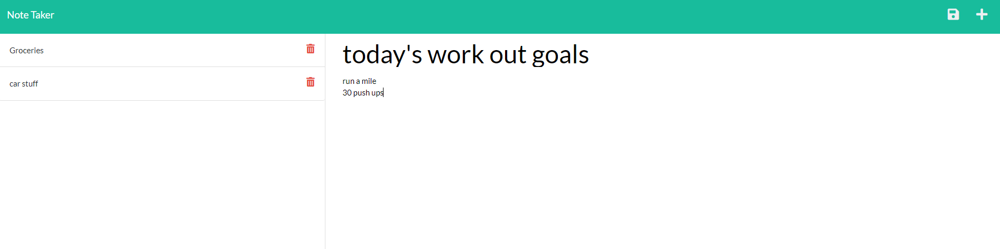

# Note-Taker
  []

  ## Table of Contents
  1. [Description](#Description)
  2. [Installation Instructions](#Installation)
  3. [Usage Instructions](#Usage)
  4. [Image](#Image)
  5. [License](#License)
  6. [Contributors](#Contributors)
  7. [Questions](#Questions)

  ## Description
  Express js application to take notes

  ## Installation
  ensure you are in the correct directory in your terminal, run a 'npm install' to download all assets

  ## Usage
  run 'npm start' to start the server, go to localhost:3001 to use application

  ## Image 
  

  ## License
  Copyright (C) function getFullYear() { [native code] }
    MIT License.
    Read more at: https://choosealicense.com/licenses/mit/

  ## Contributors
  In collaboration with: Alex Lu  

  ## Questions
  For further questions, you can reach out to me by:
  email: alu1868@gmail
  GitHub: github.com/alu1868
